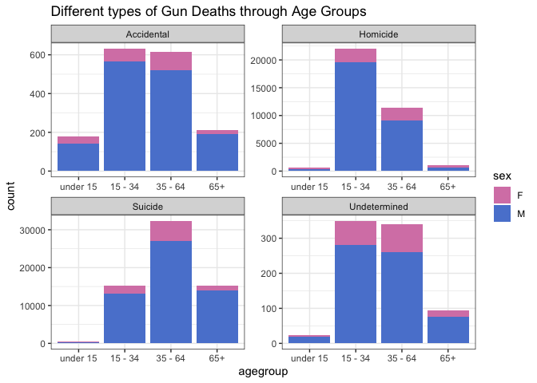
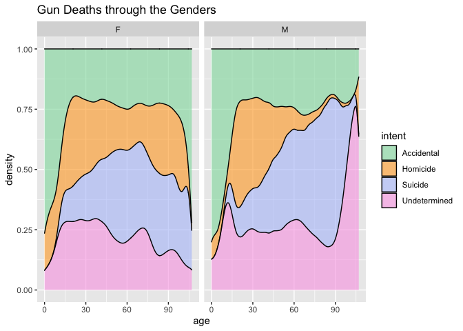
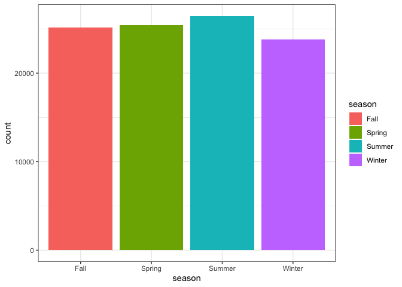
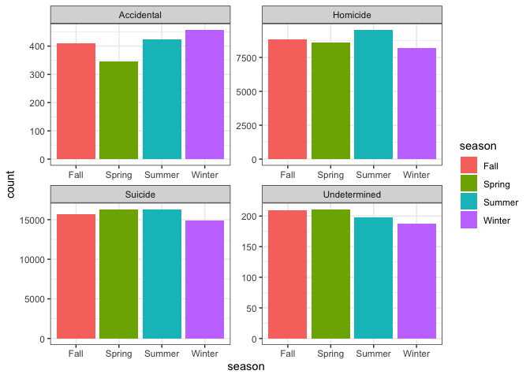

Load in the Libraries

```r
library(tidyverse)
```

```
## ── Attaching packages ─────────────────────────────────────── tidyverse 1.3.0 ──
```

```
## ✓ ggplot2 3.3.3     ✓ purrr   0.3.4
## ✓ tibble  3.0.5     ✓ dplyr   1.0.3
## ✓ tidyr   1.1.2     ✓ stringr 1.4.0
## ✓ readr   1.4.0     ✓ forcats 0.5.0
```

```
## ── Conflicts ────────────────────────────────────────── tidyverse_conflicts() ──
## x dplyr::filter() masks stats::filter()
## x dplyr::lag()    masks stats::lag()
```

```r
library(downloader)
library(readxl)
```
Read in Data

```r
GunData <- tempfile()
download("https://raw.githubusercontent.com/fivethirtyeight/guns-data/master/full_data.csv", GunData, mode = "wb")
GunData1 <- read_csv(GunData)
```

```
## Warning: Missing column names filled in: 'X1' [1]
```

```
## 
## ── Column specification ────────────────────────────────────────────────────────
## cols(
##   X1 = col_double(),
##   year = col_double(),
##   month = col_character(),
##   intent = col_character(),
##   police = col_double(),
##   sex = col_character(),
##   age = col_double(),
##   race = col_character(),
##   hispanic = col_double(),
##   place = col_character(),
##   education = col_character()
## )
```
Look at the data & structure

```r
head(GunData1)
```

```
## # A tibble: 6 x 11
##      X1  year month intent  police sex     age race    hispanic place  education
##   <dbl> <dbl> <chr> <chr>    <dbl> <chr> <dbl> <chr>      <dbl> <chr>  <chr>    
## 1     1  2012 01    Suicide      0 M        34 Asian/…      100 Home   BA+      
## 2     2  2012 01    Suicide      0 F        21 White        100 Street Some col…
## 3     3  2012 01    Suicide      0 M        60 White        100 Other… BA+      
## 4     4  2012 02    Suicide      0 M        64 White        100 Home   BA+      
## 5     5  2012 02    Suicide      0 M        31 White        100 Other… HS/GED   
## 6     6  2012 02    Suicide      0 M        17 Native…      100 Home   Less tha…
```

```r
str(GunData1)
```

```
## tibble [100,798 × 11] (S3: spec_tbl_df/tbl_df/tbl/data.frame)
##  $ X1       : num [1:100798] 1 2 3 4 5 6 7 8 9 10 ...
##  $ year     : num [1:100798] 2012 2012 2012 2012 2012 ...
##  $ month    : chr [1:100798] "01" "01" "01" "02" ...
##  $ intent   : chr [1:100798] "Suicide" "Suicide" "Suicide" "Suicide" ...
##  $ police   : num [1:100798] 0 0 0 0 0 0 0 0 0 0 ...
##  $ sex      : chr [1:100798] "M" "F" "M" "M" ...
##  $ age      : num [1:100798] 34 21 60 64 31 17 48 41 50 NA ...
##  $ race     : chr [1:100798] "Asian/Pacific Islander" "White" "White" "White" ...
##  $ hispanic : num [1:100798] 100 100 100 100 100 100 100 100 100 998 ...
##  $ place    : chr [1:100798] "Home" "Street" "Other specified" "Home" ...
##  $ education: chr [1:100798] "BA+" "Some college" "BA+" "BA+" ...
##  - attr(*, "spec")=
##   .. cols(
##   ..   X1 = col_double(),
##   ..   year = col_double(),
##   ..   month = col_character(),
##   ..   intent = col_character(),
##   ..   police = col_double(),
##   ..   sex = col_character(),
##   ..   age = col_double(),
##   ..   race = col_character(),
##   ..   hispanic = col_double(),
##   ..   place = col_character(),
##   ..   education = col_character()
##   .. )
```
Filter out the N/A value

```r
NewGunData <- GunData1 %>%
  filter(age != "", intent != "")
```
Create a new column named "Age Group"

```r
agegroup <- NewGunData %>%
  mutate(agegroup =
           case_when(
             age >= 0 & age <= 14 ~ "under 15.",
             age >= 15 & age <= 34 ~ "15 - 34",
             age >= 35 & age <= 64 ~ "35 - 64",
             age >= 65 ~ "65+"), 
         agegroup = fct_relevel(agegroup,
                                "under 15.", "15 - 34", "35 - 64", "65+")
         )
```
Create a Graph for the data

```r
ggplot(data = agegroup, mapping = aes(x = agegroup, fill = sex)) +
  geom_bar() +
  facet_wrap(~ intent, nrow = 2, scales = "free") +
  scale_fill_manual(values = c("#D784B4", "#5A84D3")) +
  theme_bw() +
  labs(title = "Different types of Gun Deaths through Age Groups")
```

<!-- -->
The second visualization does not require preparation like the first graphic.
Create a Graph

```r
ggplot(data = NewGunData, mapping = aes(x = age, fill = intent)) +
  geom_density(alpha = .6, position = "fill") +
  facet_wrap(~ sex) +
  scale_fill_manual(values = c("#8CDBAA","#FFA727","#B2C2F8","#F9A5E4")) +
  labs(title = "Gun Deaths through the Genders")
```

<!-- -->
Create a New Column named "Seasons"

```r
seasons <- NewGunData %>%
  mutate(month = as.factor(month))
```
Make the column "Month" an Integer

```r
NewGunData$month <- as.integer(NewGunData$month)
```
Create the seasons within the new column

```r
seasons <- NewGunData %>%
  mutate(season =
           case_when(
             month >= 3 & month <= 5 ~ "Spring",
             month >= 6 & month <= 8 ~ "Summer",
             month >= 9 & month <= 11 ~ "Fall",
             month >= 1 & month <= 2 ~ "Winter",
             month == 12 ~ "Winter"))
```
Graphic #1

```r
ggplot(data = seasons, mapping = aes(x = season, fill = season)) +
  geom_bar() +
  theme_bw()
```

<!-- -->
In this graph, I plotted the different seasons and the count of deaths per season. The reason this graph is important is because it shows that season does not make a difference in Gun Deaths.

Graphic #2

```r
ggplot(data = seasons, mapping = aes(x = season, fill = season)) +
  geom_bar() +
  facet_wrap(~ intent, nrow = 2, scales = "free") +
  theme_bw()
```

<!-- -->
I created this graph because I wanted to see the different types of deaths throughout the seasons. From this we can assume that the season does not have an effect of the type of deaths.
