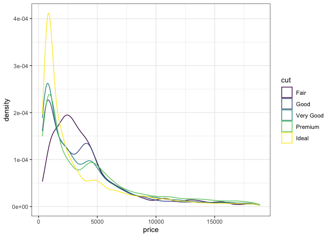

Load in Libraries

```r
library(tidyverse)
```

```
## ── Attaching packages ─────────────────────────────────────── tidyverse 1.3.0 ──
```

```
## ✓ ggplot2 3.3.3     ✓ purrr   0.3.4
## ✓ tibble  3.0.5     ✓ dplyr   1.0.3
## ✓ tidyr   1.1.2     ✓ stringr 1.4.0
## ✓ readr   1.4.0     ✓ forcats 0.5.0
```

```
## ── Conflicts ────────────────────────────────────────── tidyverse_conflicts() ──
## x dplyr::filter() masks stats::filter()
## x dplyr::lag()    masks stats::lag()
```

```r
library(RColorBrewer)
```
Load in data

```r
head(diamonds)
```

```
## # A tibble: 6 x 10
##   carat cut       color clarity depth table price     x     y     z
##   <dbl> <ord>     <ord> <ord>   <dbl> <dbl> <int> <dbl> <dbl> <dbl>
## 1 0.23  Ideal     E     SI2      61.5    55   326  3.95  3.98  2.43
## 2 0.21  Premium   E     SI1      59.8    61   326  3.89  3.84  2.31
## 3 0.23  Good      E     VS1      56.9    65   327  4.05  4.07  2.31
## 4 0.290 Premium   I     VS2      62.4    58   334  4.2   4.23  2.63
## 5 0.31  Good      J     SI2      63.3    58   335  4.34  4.35  2.75
## 6 0.24  Very Good J     VVS2     62.8    57   336  3.94  3.96  2.48
```

```r
str(diamonds)
```

```
## tibble [53,940 × 10] (S3: tbl_df/tbl/data.frame)
##  $ carat  : num [1:53940] 0.23 0.21 0.23 0.29 0.31 0.24 0.24 0.26 0.22 0.23 ...
##  $ cut    : Ord.factor w/ 5 levels "Fair"<"Good"<..: 5 4 2 4 2 3 3 3 1 3 ...
##  $ color  : Ord.factor w/ 7 levels "D"<"E"<"F"<"G"<..: 2 2 2 6 7 7 6 5 2 5 ...
##  $ clarity: Ord.factor w/ 8 levels "I1"<"SI2"<"SI1"<..: 2 3 5 4 2 6 7 3 4 5 ...
##  $ depth  : num [1:53940] 61.5 59.8 56.9 62.4 63.3 62.8 62.3 61.9 65.1 59.4 ...
##  $ table  : num [1:53940] 55 61 65 58 58 57 57 55 61 61 ...
##  $ price  : int [1:53940] 326 326 327 334 335 336 336 337 337 338 ...
##  $ x      : num [1:53940] 3.95 3.89 4.05 4.2 4.34 3.94 3.95 4.07 3.87 4 ...
##  $ y      : num [1:53940] 3.98 3.84 4.07 4.23 4.35 3.96 3.98 4.11 3.78 4.05 ...
##  $ z      : num [1:53940] 2.43 2.31 2.31 2.63 2.75 2.48 2.47 2.53 2.49 2.39 ...
```
1. Make visualizations to give the distribution of each of the x, y, and z variables in the diamonds data set.
Graph for X

```r
ggplot(diamonds, aes(x = x)) +
  stat_bin(breaks = seq(0, 10.74, .01), alpha = .9) +
  theme_bw()
```

<!-- -->
Graph for Y

```r
ggplot(diamonds, aes(x = y)) +
  stat_bin(breaks = seq(3, 10, .01), alpha = .9) +
  theme_bw()
```

<!-- -->
Graph for Z

```r
ggplot(diamonds, aes(x = z)) +
  stat_bin(breaks = seq(2, 6.5, .01), alpha = .9) +
  theme_bw()
```

<!-- -->
2. Explore the distribution of price. Is there anything unusual or surprising?

```r
ggplot(diamonds, aes(x = price)) +
  stat_bin(breaks = seq(326, 18823, 50)) +
  theme_bw()
```

<!-- -->
After looking at this graph I can see there is a blank space somewhere between 0 and 2,500.
Closer Look Graph

```r
closerlook <- diamonds %>%
  filter(price < 2500) 

ggplot(closerlook, aes(x = price)) +
  stat_bin(breaks = seq(326, 2500, 10)) +
  theme_bw()
```

<!-- -->
From this, I can tell there is no diamonds being sold in between the range 14,000 through 1,500. There seems to be a certain threshold.

3. Can you determine what variable in the diamonds dataset is most important for predicting the price of a diamond? How is that variable correlated with cut? Why does the combination of those two relationships lead to lower quality diamonds being more expensive?

```r
ggplot(diamonds, aes(x = price, color = cut,)) +
  geom_density() +
  theme_bw()
```

<!-- -->


```r
ggplot(diamonds, aes(x = price, fill = cut)) +
  stat_bin(breaks = seq(0, 20000, 500)) +
  facet_wrap(~ cut, ncol = 3, scales = "free") +
  theme_bw()
```

<!-- -->


```r
diamonds %>%
  mutate(color = fct_rev(color)) 
```

```
## # A tibble: 53,940 x 10
##    carat cut       color clarity depth table price     x     y     z
##    <dbl> <ord>     <ord> <ord>   <dbl> <dbl> <int> <dbl> <dbl> <dbl>
##  1 0.23  Ideal     E     SI2      61.5    55   326  3.95  3.98  2.43
##  2 0.21  Premium   E     SI1      59.8    61   326  3.89  3.84  2.31
##  3 0.23  Good      E     VS1      56.9    65   327  4.05  4.07  2.31
##  4 0.290 Premium   I     VS2      62.4    58   334  4.2   4.23  2.63
##  5 0.31  Good      J     SI2      63.3    58   335  4.34  4.35  2.75
##  6 0.24  Very Good J     VVS2     62.8    57   336  3.94  3.96  2.48
##  7 0.24  Very Good I     VVS1     62.3    57   336  3.95  3.98  2.47
##  8 0.26  Very Good H     SI1      61.9    55   337  4.07  4.11  2.53
##  9 0.22  Fair      E     VS2      65.1    61   337  3.87  3.78  2.49
## 10 0.23  Very Good H     VS1      59.4    61   338  4     4.05  2.39
## # … with 53,930 more rows
```

```r
ggplot(diamonds, aes(x = color, y = price, fill = color)) +
  geom_boxplot() +
  theme_bw()
```

<!-- -->
There is a negative correlation between color and price. 

```r
ggplot(diamonds, aes(x = clarity, y = price, fill = clarity)) +
  geom_boxplot() +
  theme_bw()
```

<!-- -->
There is also a negative relationship with clairty and price
4. Make a visualization of carat partitioned by price.
Create a New column

```r
new_diamonds <- diamonds %>%
  mutate(pricegroup = 
           case_when(
             price >= 0 & price <= 2000 ~ "1 - 2000",

price >= 2001 & price <= 4000 ~ "2001 - 4000",
             price >= 4001 & price <= 6000 ~ "4001 - 6000",
             price >= 6001 & price <= 8000 ~ "6001 - 8000",
             price >= 8001 & price <= 10000 ~ "8001 - 10000",
             price >= 10001 & price <= 12000 ~ "10001 - 12000",
             price >= 12001 & price <= 14000 ~ "12001 - 14000",
             price >= 14001 & price <= 16000 ~ "14001 - 16000",
             price >= 16001 & price <= 18000 ~ "16001 - 18000",
             price >= 18001 & price <= 20000 ~ "18001 - 20000"),
         pricegroup = fct_relevel(pricegroup,
                                  "1 - 2000", "2001 - 4000", "4001 - 6000", "6001 - 8000", "8001 - 10000", "10001 - 12000", "14001 - 16000", "18001 - 20000"))
```
Graph

```r
ggplot(new_diamonds, aes(x = pricegroup, y = carat, fill = pricegroup)) +
  geom_boxplot() +
  coord_flip() +
  scale_fill_brewer(palette = "Paired") +
  theme_bw()
```

<!-- -->
5. How does the price distribution of very large diamonds compare to small diamonds? Does the data agree with your expectations?

```r
diamonds %>%
  filter(between(carat, 0, 2.5)) %>%
  mutate(carat = cut_width(carat, 1))
```

```
## # A tibble: 53,814 x 10
##    carat      cut       color clarity depth table price     x     y     z
##    <fct>      <ord>     <ord> <ord>   <dbl> <dbl> <int> <dbl> <dbl> <dbl>
##  1 [-0.5,0.5] Ideal     E     SI2      61.5    55   326  3.95  3.98  2.43
##  2 [-0.5,0.5] Premium   E     SI1      59.8    61   326  3.89  3.84  2.31
##  3 [-0.5,0.5] Good      E     VS1      56.9    65   327  4.05  4.07  2.31
##  4 [-0.5,0.5] Premium   I     VS2      62.4    58   334  4.2   4.23  2.63
##  5 [-0.5,0.5] Good      J     SI2      63.3    58   335  4.34  4.35  2.75
##  6 [-0.5,0.5] Very Good J     VVS2     62.8    57   336  3.94  3.96  2.48
##  7 [-0.5,0.5] Very Good I     VVS1     62.3    57   336  3.95  3.98  2.47
##  8 [-0.5,0.5] Very Good H     SI1      61.9    55   337  4.07  4.11  2.53
##  9 [-0.5,0.5] Fair      E     VS2      65.1    61   337  3.87  3.78  2.49
## 10 [-0.5,0.5] Very Good H     VS1      59.4    61   338  4     4.05  2.39
## # … with 53,804 more rows
```

```r
ggplot(diamonds, aes(x = price)) +
  stat_bin(breaks = seq(0, 19000, 200)) +
  theme_bw()
```

<!-- -->
I am a little surprised by the lack of difference of the distribution as price goes up. 
6. Visualize a combined distribution of cut, carat, and price.

```r
diamonds %>%
  filter(between(carat, 0, 2.5)) %>%
  mutate(carat = cut_width(carat, 1)) %>%
  ggplot(aes(x = cut, y = price, fill = cut)) +
  geom_boxplot() +
  facet_wrap(~ carat) +
  scale_fill_manual(values = c("#B81918", "#D45625", "#EAB521", "#E4D51F", "#A9D222")) +
  theme_bw()
```

<!-- -->


