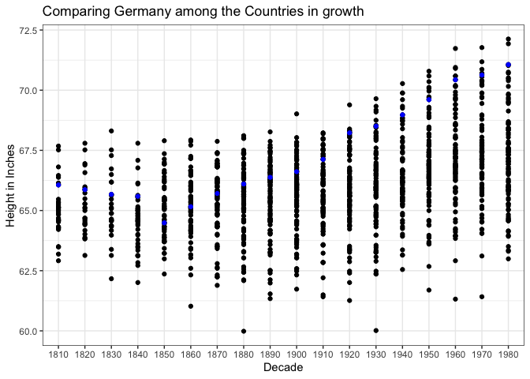
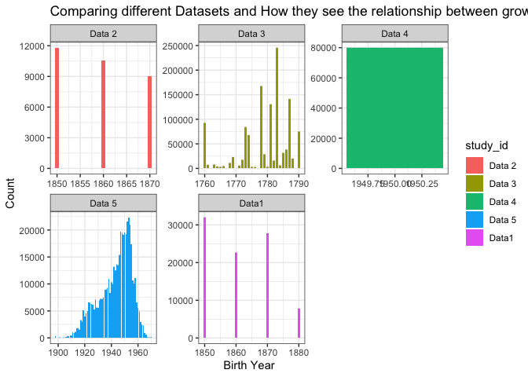

```r
library(readr)
library(haven)
library(readxl)
library(tidyverse)
```

```
## ── Attaching packages ─────────────────────────────────────── tidyverse 1.3.0 ──
```

```
## ✓ ggplot2 3.3.3     ✓ dplyr   1.0.3
## ✓ tibble  3.0.5     ✓ stringr 1.4.0
## ✓ tidyr   1.1.2     ✓ forcats 0.5.0
## ✓ purrr   0.3.4
```

```
## ── Conflicts ────────────────────────────────────────── tidyverse_conflicts() ──
## x dplyr::filter() masks stats::filter()
## x dplyr::lag()    masks stats::lag()
```

```r
library(downloader)
library(haven)
library(foreign)
```


```r
bob1 <- tempfile()
download("https://github.com/WJC-Data-Science/DTS350/raw/master/Height.xlsx", bob1, mode = "wb")
Data1 <- read_xlsx(bob1, skip = 2)

bob2 <- tempfile()
download("https://github.com/WJC-Data-Science/DTS350/raw/master/germanconscr.dta", bob2, mode = "wb")
Data2 <- read_dta(bob2)
head(Data2)
```

```
## # A tibble: 6 x 5
##   gebger      bdec height   age co   
##   <chr>      <dbl>  <dbl> <dbl> <chr>
## 1 brueckenau  1850   170.    21 de-se
## 2 brueckenau  1850   156.    21 de-se
## 3 brueckenau  1850   172.    21 de-se
## 4 brueckenau  1850   168.    21 de-se
## 5 brueckenau  1850   167.    21 de-se
## 6 brueckenau  1850   160.    21 de-se
```

```r
bob3 <- tempfile()
download("https://github.com/WJC-Data-Science/DTS350/raw/master/germanprison.dta", bob3, mode = "wb")
Data3 <- read_dta(bob3)
head(Data3)
```

```
## # A tibble: 6 x 4
##     age  bdec co    height
##   <dbl> <dbl> <chr>  <dbl>
## 1    22  1850 de       156
## 2    26  1850 de       168
## 3    26  1850 de       161
## 4    25  1850 de       159
## 5    26  1850 de       175
## 6    24  1850 de       173
```

```r
bob4 <- tempfile()
download("https://github.com/WJC-Data-Science/DTS350/raw/master/Heights_south-east/B6090.DBF", bob4, mode = "wb")
Data4 <- read.dbf(bob4, as.is = FALSE)
head(Data4)
```

```
##   RECNO   SJ REG GEBGER SL GEBJZ GEWERBE BERUF STD_ELT F  Z V S GEBJ CMETER
## 1  3669 1773   2    lau  0   173    <NA>     0    <NA> 6  1 0 0 1733 177.55
## 2  3670 1773   2     ma  0   173    <NA>     0    <NA> 5  8 0 0 1737 165.39
## 3  3671 1773   2    bre  0   175    <NA>     0    <NA> 5 11 0 0 1750 172.68
## 4  3672 1773   2    neu  0   173    <NA>     0    <NA> 5 11 0 0 1734 172.68
## 5  3673 1773   2    alz  0   173    <NA>     0    <NA> 6  0 2 0 1734 176.33
## 6  3674 1773   2     hd  0   173    <NA>     0    <NA> 5  6 0 0 1737 160.52
##   MASS ALTER ALTERGR ARMGATT ZOLLABRD ZOLLVRD   KOM2 REGIM  COMP GREN LEIB OFF1
## 1    v    40       6       0       73    73.0 B03H18 06.ir riedl    0    0    1
## 2    v    36       6       0       68    68.0 B03H18 06.ir riedl    0    0    1
## 3    v    23       6       0       71    71.0 B03H18 06.ir riedl    0    0    0
## 4    v    39       6       0       71    71.0 B03H18 06.ir riedl    0    0    0
## 5    v    39       6       0       72    72.5 B03H18 06.ir riedl    0    0    0
## 6    v    36       6       0       66    66.0 B03H18 06.ir riedl    0    0    0
##   OFF2 OPF PF A16 A17 A18 A19 A20 A21 A22 A50 G2529 G3034 G3539 G4044 G4549
## 1    0   0  1   0   0   0   0   0   0   0   0     0     1     0     0     0
## 2    0   0  1   0   0   0   0   0   0   0   0     0     0     1     0     0
## 3    1   0  1   0   0   0   0   0   0   0   0     0     0     0     0     0
## 4    1   0  1   0   0   0   0   0   0   0   0     0     1     0     0     0
## 5    1   0  1   0   0   0   0   0   0   0   0     0     1     0     0     0
## 6    1   0  1   0   0   0   0   0   0   0   0     0     0     1     0     0
##   G5054 G5559 G6064 G6569 G7074 COMPOS
## 1     0     0     0     0     0      1
## 2     0     0     0     0     0      2
## 3     1     0     0     0     0      3
## 4     0     0     0     0     0      4
## 5     0     0     0     0     0      5
## 6     0     0     0     0     0      6
```

```r
Data4 <- tibble(Data4)

bob5 <- tempfile()
download("https://raw.githubusercontent.com/hadley/r4ds/master/data/heights.csv", bob5, mode = "wb")
Data5 <- read_csv(bob5)
```

```
## 
## ── Column specification ────────────────────────────────────────────────────────
## cols(
##   earn = col_double(),
##   height = col_double(),
##   sex = col_character(),
##   ed = col_double(),
##   age = col_double(),
##   race = col_character()
## )
```

```r
head(Data5)
```

```
## # A tibble: 6 x 6
##    earn height sex       ed   age race 
##   <dbl>  <dbl> <chr>  <dbl> <dbl> <chr>
## 1 50000   74.4 male      16    45 white
## 2 60000   65.5 female    16    58 white
## 3 30000   63.6 female    16    29 white
## 4 50000   63.1 female    16    91 other
## 5 51000   63.4 female    17    39 white
## 6  9000   64.4 female    15    26 white
```

```r
bob6 <- tempfile()
download("http://www.ssc.wisc.edu/nsfh/wave3/NSFH3%20Apr%202005%20release/main05022005.sav", bob6, mode = "wb")
Data6 <- read_sav(bob6)
head(Data6)
```

```
## # A tibble: 6 x 2,317
##   CASE  TYPE  CASEID CASENUM     DOBM  DOBY    RT1A1    RT1A2    RT1A3   RT1B1
##   <chr> <chr> <chr>    <dbl> <dbl+lb> <dbl> <dbl+lb> <dbl+lb> <dbl+lb> <dbl+l>
## 1 00008 S     00008S       8 10 [OCT…    15  5       NA       NA       3      
## 2 00058 R     00058R      58  2 [FEB…    40  3        0 [NON…  1       2      
## 3 00058 S     00058S      58  2 [FEB…    40  0 [NON… NA       NA       0 [NON…
## 4 00079 S     00079S      79 11 [NOV…    12  7       NA       NA       0 [NON…
## 5 00082 S     00082S      82  7 [JUL…    61  4       NA        1       4      
## 6 00120 R     00120R     120 10 [OCT…    54 14        0 [NON…  0 [NON… 7      
## # … with 2,307 more variables: RT1B2 <dbl+lbl>, RT1B3 <dbl+lbl>,
## #   RT1C1 <dbl+lbl>, RT1C2 <dbl+lbl>, RT1C3 <dbl+lbl>, RT1D1 <dbl+lbl>,
## #   RT1D2 <dbl+lbl>, RT1D3 <dbl+lbl>, RT1E1 <dbl+lbl>, RT1E2 <dbl+lbl>,
## #   RT1E3 <dbl+lbl>, RT1F1 <dbl+lbl>, RT1F2 <dbl+lbl>, RT1F3 <dbl+lbl>,
## #   RT1G1 <dbl+lbl>, RT1G2 <dbl+lbl>, RT1G3 <dbl+lbl>, RT1H1 <dbl+lbl>,
## #   RT1H2 <dbl+lbl>, RT1H3 <dbl+lbl>, RT1I1 <dbl+lbl>, RT1I2 <dbl+lbl>,
## #   RT1I3 <dbl+lbl>, RT204 <dbl+lbl>, RE1 <dbl+lbl>, RE3 <dbl>, RE4 <dbl>,
## #   RT205A <dbl+lbl>, RT205B <dbl+lbl>, RT205C <dbl+lbl>, RT205D <dbl+lbl>,
## #   RT205E <dbl+lbl>, RT205F <dbl+lbl>, RT205G <dbl>, RE5 <dbl+lbl>, RE6 <dbl>,
## #   RE7 <dbl>, RE8 <dbl+lbl>, RE10 <dbl>, RE11 <dbl>, RE12 <dbl+lbl>,
## #   RE14 <dbl>, RE15 <dbl>, RE16 <dbl+lbl>, RE19 <dbl+lbl>, RE22 <dbl+lbl>,
## #   RE25 <dbl+lbl>, RE28 <dbl+lbl>, RE31 <dbl+lbl>, RE32 <dbl>, RE35 <dbl+lbl>,
## #   RE36 <chr>, RE37 <dbl+lbl>, RE38 <dbl+lbl>, RE39 <dbl+lbl>, RE40 <dbl+lbl>,
## #   RE41 <dbl>, RE44 <dbl+lbl>, RE45 <dbl+lbl>, RE46 <dbl+lbl>, RE47 <dbl+lbl>,
## #   RE48 <dbl+lbl>, RE51 <dbl+lbl>, RE50 <dbl+lbl>, RE52 <dbl+lbl>,
## #   RE55 <dbl+lbl>, RF1 <dbl+lbl>, RF2 <dbl+lbl>, RF3 <dbl+lbl>, RF4 <dbl+lbl>,
## #   RF5 <dbl+lbl>, RF6 <dbl+lbl>, RF7 <dbl+lbl>, RF8 <dbl+lbl>, RF9 <dbl+lbl>,
## #   RF10 <dbl+lbl>, RF11 <dbl+lbl>, RF12 <dbl+lbl>, RF13 <dbl+lbl>,
## #   RF14 <dbl+lbl>, RF15 <dbl+lbl>, RF16 <dbl+lbl>, RF17 <dbl+lbl>,
## #   RF18 <dbl+lbl>, RF19 <dbl+lbl>, RF20 <dbl+lbl>, RF21 <dbl+lbl>,
## #   RF22 <dbl+lbl>, RF23 <dbl+lbl>, RF24M <dbl+lbl>, RF24Y <dbl+lbl>,
## #   RF24F <dbl>, RF25 <dbl+lbl>, RF26 <dbl+lbl>, RF27 <dbl+lbl>,
## #   RF28 <dbl+lbl>, RF29 <dbl+lbl>, RF30 <dbl+lbl>, RF31 <dbl+lbl>,
## #   RF32 <dbl+lbl>, …
```


```r
worlddata <- Data1 %>%
  pivot_longer(3:203, names_to = "years", values_to = "heights.cm", values_drop_na = TRUE) %>%
  mutate(year_decade = years, 
         height.in = heights.cm/2.54) %>%
  separate(years, into = c("century", "decade"), sep = -2) %>%
  separate(decade, into = c("decade", "year"), sep = -1) 
```


```r
one <- Data2 %>%
  mutate(birth_year = bdec, 
         height.cm = height, 
         height.in = height.cm/2.54,
         study_id = "Data1") %>%
  select(birth_year, height.cm, height.in, study_id)
```


```r
two <- Data3 %>%
  mutate(birth_year = bdec,
         height.cm = height,
         height.in = height.cm/ 2.54,
         study_id = "Data 2") %>%
  select(birth_year, height.in, height.cm, study_id)
```


```r
three <-  Data4 %>%
  mutate(height.in = CMETER/2.54,
         height.cm = CMETER,
         birth_year = SJ,
         study_id = "Data 3") %>%
  select(height.in, height.cm, birth_year, study_id)
```


```r
four <- Data5 %>%
  mutate(birth_year = 1950,
         height.in = height,
         height.cm = height.in*2.54,
         study_id = "Data 4") %>%
  select(birth_year, height.cm, height.in, study_id)
```


```r
five <- Data6 %>%
  mutate(birth_year = DOBY + 1900,
         height.in = RT216F * 12 + RT216I,
         height.cm = height.in*2.54,
         study_id = "Data 5") %>%
  select(birth_year, height.in, height.cm, study_id)
```


```r
total <- bind_rows(one, two, three, four, five)
head(total)
```

```
## # A tibble: 6 x 4
##   birth_year height.cm height.in study_id
##        <dbl>     <dbl>     <dbl> <chr>   
## 1       1850      170.      66.8 Data1   
## 2       1850      156.      61.6 Data1   
## 3       1850      172.      67.9 Data1   
## 4       1850      168.      66.2 Data1   
## 5       1850      167.      65.6 Data1   
## 6       1850      160.      63.1 Data1
```


```r
germdata <- worlddata %>%
  filter(`Continent, Region, Country` == "Germany")
head(germdata)
```

```
## # A tibble: 6 x 8
##    Code `Continent, Regio… century decade year  heights.cm year_decade height.in
##   <dbl> <chr>              <chr>   <chr>  <chr>      <dbl> <chr>           <dbl>
## 1   276 Germany            18      1      0           168. 1810             66.1
## 2   276 Germany            18      2      0           167. 1820             65.9
## 3   276 Germany            18      3      0           167. 1830             65.7
## 4   276 Germany            18      4      0           167. 1840             65.6
## 5   276 Germany            18      5      0           164. 1850             64.5
## 6   276 Germany            18      6      0           166. 1860             65.2
```


```r
ggplot(worlddata, aes(x = year_decade, y = height.in)) +
  geom_point() +
  geom_point(data = germdata, color = "blue") +
  labs(x = "Decade",
       y = "Height in Inches",
       title = "Comparing Germany among the Countries in growth") +
  theme_bw()
```

<!-- -->
In this graph, we can see the different growth rates for each country. I highlighted the country Germany that way we can see the different growth rate for on specific country. From the overall graph, we can see that there is a height change as the years go on. From the highlighted points in this specific graph, we can confirm our last assumption of height is changing throughout the decades. 


```r
ggplot(total, aes(x = birth_year, y = height.in, fill = study_id)) +
  geom_col() +
  facet_wrap(~ study_id, scales = "free") +
  theme_bw() +
  labs(x = "Birth Year",
       y = "Count",
       title = "Comparing different Datasets and How they see the relationship between growth")
```

```
## Warning: Removed 21 rows containing missing values (position_stack).
```

<!-- -->

In this graph, I am comparing growth through the years from the 5 different data sets we have created. I had the previous idea that growth was increasing throughout the years but because of this graph, we cannot confirm this hypothesis. Growth is changing, but it is not consistent enough to make a decision of what it is exactly doing.
