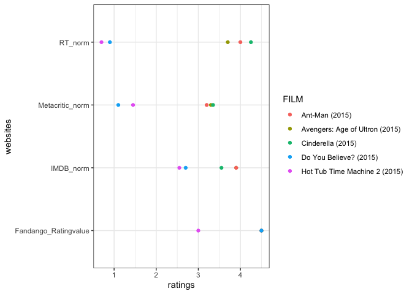

```r
library(tidyverse)
```

```
## ── Attaching packages ─────────────────────────────────────── tidyverse 1.3.0 ──
```

```
## ✓ ggplot2 3.3.3     ✓ purrr   0.3.4
## ✓ tibble  3.0.5     ✓ dplyr   1.0.3
## ✓ tidyr   1.1.2     ✓ stringr 1.4.0
## ✓ readr   1.4.0     ✓ forcats 0.5.0
```

```
## ── Conflicts ────────────────────────────────────────── tidyverse_conflicts() ──
## x dplyr::filter() masks stats::filter()
## x dplyr::lag()    masks stats::lag()
```

```r
library(downloader)
library(readxl)
library(plotly)
```

```
## 
## Attaching package: 'plotly'
```

```
## The following object is masked from 'package:ggplot2':
## 
##     last_plot
```

```
## The following object is masked from 'package:stats':
## 
##     filter
```

```
## The following object is masked from 'package:graphics':
## 
##     layout
```


```r
MData <- tempfile()
download("https://raw.githubusercontent.com/fivethirtyeight/data/master/fandango/fandango_score_comparison.csv", MData, mode = "wb")
MovieData <- read_csv(MData)
```

```
## 
## ── Column specification ────────────────────────────────────────────────────────
## cols(
##   .default = col_double(),
##   FILM = col_character()
## )
## ℹ Use `spec()` for the full column specifications.
```


```r
str(MovieData)
```

```
## tibble [146 × 22] (S3: spec_tbl_df/tbl_df/tbl/data.frame)
##  $ FILM                      : chr [1:146] "Avengers: Age of Ultron (2015)" "Cinderella (2015)" "Ant-Man (2015)" "Do You Believe? (2015)" ...
##  $ RottenTomatoes            : num [1:146] 74 85 80 18 14 63 42 86 99 89 ...
##  $ RottenTomatoes_User       : num [1:146] 86 80 90 84 28 62 53 64 82 87 ...
##  $ Metacritic                : num [1:146] 66 67 64 22 29 50 53 81 81 80 ...
##  $ Metacritic_User           : num [1:146] 7.1 7.5 8.1 4.7 3.4 6.8 7.6 6.8 8.8 8.5 ...
##  $ IMDB                      : num [1:146] 7.8 7.1 7.8 5.4 5.1 7.2 6.9 6.5 7.4 7.8 ...
##  $ Fandango_Stars            : num [1:146] 5 5 5 5 3.5 4.5 4 4 4.5 4.5 ...
##  $ Fandango_Ratingvalue      : num [1:146] 4.5 4.5 4.5 4.5 3 4 3.5 3.5 4 4 ...
##  $ RT_norm                   : num [1:146] 3.7 4.25 4 0.9 0.7 3.15 2.1 4.3 4.95 4.45 ...
##  $ RT_user_norm              : num [1:146] 4.3 4 4.5 4.2 1.4 3.1 2.65 3.2 4.1 4.35 ...
##  $ Metacritic_norm           : num [1:146] 3.3 3.35 3.2 1.1 1.45 2.5 2.65 4.05 4.05 4 ...
##  $ Metacritic_user_nom       : num [1:146] 3.55 3.75 4.05 2.35 1.7 3.4 3.8 3.4 4.4 4.25 ...
##  $ IMDB_norm                 : num [1:146] 3.9 3.55 3.9 2.7 2.55 3.6 3.45 3.25 3.7 3.9 ...
##  $ RT_norm_round             : num [1:146] 3.5 4.5 4 1 0.5 3 2 4.5 5 4.5 ...
##  $ RT_user_norm_round        : num [1:146] 4.5 4 4.5 4 1.5 3 2.5 3 4 4.5 ...
##  $ Metacritic_norm_round     : num [1:146] 3.5 3.5 3 1 1.5 2.5 2.5 4 4 4 ...
##  $ Metacritic_user_norm_round: num [1:146] 3.5 4 4 2.5 1.5 3.5 4 3.5 4.5 4.5 ...
##  $ IMDB_norm_round           : num [1:146] 4 3.5 4 2.5 2.5 3.5 3.5 3.5 3.5 4 ...
##  $ Metacritic_user_vote_count: num [1:146] 1330 249 627 31 88 34 17 124 62 54 ...
##  $ IMDB_user_vote_count      : num [1:146] 271107 65709 103660 3136 19560 ...
##  $ Fandango_votes            : num [1:146] 14846 12640 12055 1793 1021 ...
##  $ Fandango_Difference       : num [1:146] 0.5 0.5 0.5 0.5 0.5 0.5 0.5 0.5 0.5 0.5 ...
##  - attr(*, "spec")=
##   .. cols(
##   ..   FILM = col_character(),
##   ..   RottenTomatoes = col_double(),
##   ..   RottenTomatoes_User = col_double(),
##   ..   Metacritic = col_double(),
##   ..   Metacritic_User = col_double(),
##   ..   IMDB = col_double(),
##   ..   Fandango_Stars = col_double(),
##   ..   Fandango_Ratingvalue = col_double(),
##   ..   RT_norm = col_double(),
##   ..   RT_user_norm = col_double(),
##   ..   Metacritic_norm = col_double(),
##   ..   Metacritic_user_nom = col_double(),
##   ..   IMDB_norm = col_double(),
##   ..   RT_norm_round = col_double(),
##   ..   RT_user_norm_round = col_double(),
##   ..   Metacritic_norm_round = col_double(),
##   ..   Metacritic_user_norm_round = col_double(),
##   ..   IMDB_norm_round = col_double(),
##   ..   Metacritic_user_vote_count = col_double(),
##   ..   IMDB_user_vote_count = col_double(),
##   ..   Fandango_votes = col_double(),
##   ..   Fandango_Difference = col_double()
##   .. )
```

```r
head(MovieData)
```

```
## # A tibble: 6 x 22
##   FILM  RottenTomatoes RottenTomatoes_… Metacritic Metacritic_User  IMDB
##   <chr>          <dbl>            <dbl>      <dbl>           <dbl> <dbl>
## 1 Aven…             74               86         66             7.1   7.8
## 2 Cind…             85               80         67             7.5   7.1
## 3 Ant-…             80               90         64             8.1   7.8
## 4 Do Y…             18               84         22             4.7   5.4
## 5 Hot …             14               28         29             3.4   5.1
## 6 The …             63               62         50             6.8   7.2
## # … with 16 more variables: Fandango_Stars <dbl>, Fandango_Ratingvalue <dbl>,
## #   RT_norm <dbl>, RT_user_norm <dbl>, Metacritic_norm <dbl>,
## #   Metacritic_user_nom <dbl>, IMDB_norm <dbl>, RT_norm_round <dbl>,
## #   RT_user_norm_round <dbl>, Metacritic_norm_round <dbl>,
## #   Metacritic_user_norm_round <dbl>, IMDB_norm_round <dbl>,
## #   Metacritic_user_vote_count <dbl>, IMDB_user_vote_count <dbl>,
## #   Fandango_votes <dbl>, Fandango_Difference <dbl>
```

```r
tail(MovieData)
```

```
## # A tibble: 6 x 22
##   FILM  RottenTomatoes RottenTomatoes_… Metacritic Metacritic_User  IMDB
##   <chr>          <dbl>            <dbl>      <dbl>           <dbl> <dbl>
## 1 Insi…             98               90         94             8.9   8.6
## 2 Mr. …             87               78         67             7.9   7.4
## 3 '71 …             97               82         83             7.5   7.2
## 4 Two …             97               78         89             8.8   7.4
## 5 Gett…            100               81         90             7.3   7.8
## 6 Kumi…             87               63         68             6.4   6.7
## # … with 16 more variables: Fandango_Stars <dbl>, Fandango_Ratingvalue <dbl>,
## #   RT_norm <dbl>, RT_user_norm <dbl>, Metacritic_norm <dbl>,
## #   Metacritic_user_nom <dbl>, IMDB_norm <dbl>, RT_norm_round <dbl>,
## #   RT_user_norm_round <dbl>, Metacritic_norm_round <dbl>,
## #   Metacritic_user_norm_round <dbl>, IMDB_norm_round <dbl>,
## #   Metacritic_user_vote_count <dbl>, IMDB_user_vote_count <dbl>,
## #   Fandango_votes <dbl>, Fandango_Difference <dbl>
```


```r
NewData <- MovieData %>%
  select(FILM, RT_norm, Metacritic_norm, IMDB_norm, Fandango_Ratingvalue) %>%
  pivot_longer(2:5, names_to = "websites", values_to = "ratings") %>%
  select(FILM, websites, ratings)
```


```r
view(NewData)
```


```r
f20_ratings <- head(NewData, n = 20)
view(f20_ratings)
```


```r
ggplot(f20_ratings, aes(x = ratings, y = websites, color = FILM)) +
  geom_point() +
  theme_bw()
```

<!-- -->

```r
moviegraph <- ggplot(f20_ratings, aes(x = websites, y = ratings, fill = websites, text = websites)) +
  geom_col(position = "dodge") +
  facet_wrap(~ FILM, nrow = 1) +
  scale_fill_discrete(name = "Websites", labels = c("Fandango", "IMDB", "Metracritic", "Rotton Tomatoes")) +
  scale_x_discrete(name = "Type of Websites", labels = c(" ", " ", " ", " ")) +
  scale_fill_brewer(palette = "Set2") +
  labs(x = "Type of Websites",
       y = "Ratings",
       title = "Comparing Different Movie Ranking Sites",
       caption = "I used a Column graph with a facet wrap seperating the different types of movies. \nI did those so the user would be able to make direct comparisons within the movie ratings itself. \nFrom this graph, we can see that Fandago has the highest rankings for each movie, followed by IMDB. \nMetacritic and Rotton Tomatos switch between each movie.") +
  theme_bw()
```

```
## Scale for 'fill' is already present. Adding another scale for 'fill', which
## will replace the existing scale.
```

```r
ggplotly(moviegraph, tooltip = "text")
```

```{=html}
<div id="htmlwidget-14572a71189531040a8c" style="width:672px;height:480px;" class="plotly html-widget"></div>
<script type="application/json" data-for="htmlwidget-14572a71189531040a8c">{"x":{"data":[{"orientation":"v","width":0.9,"base":0,"x":[1],"y":[4.5],"text":"Fandango_Ratingvalue","type":"bar","marker":{"autocolorscale":false,"color":"rgba(102,194,165,1)","line":{"width":1.88976377952756,"color":"transparent"}},"name":"Fandango_Ratingvalue","legendgroup":"Fandango_Ratingvalue","showlegend":true,"xaxis":"x","yaxis":"y","hoverinfo":"text","frame":null},{"orientation":"v","width":0.9,"base":0,"x":[1],"y":[4.5],"text":"Fandango_Ratingvalue","type":"bar","marker":{"autocolorscale":false,"color":"rgba(102,194,165,1)","line":{"width":1.88976377952756,"color":"transparent"}},"name":"Fandango_Ratingvalue","legendgroup":"Fandango_Ratingvalue","showlegend":false,"xaxis":"x2","yaxis":"y","hoverinfo":"text","frame":null},{"orientation":"v","width":0.9,"base":0,"x":[1],"y":[4.5],"text":"Fandango_Ratingvalue","type":"bar","marker":{"autocolorscale":false,"color":"rgba(102,194,165,1)","line":{"width":1.88976377952756,"color":"transparent"}},"name":"Fandango_Ratingvalue","legendgroup":"Fandango_Ratingvalue","showlegend":false,"xaxis":"x3","yaxis":"y","hoverinfo":"text","frame":null},{"orientation":"v","width":0.9,"base":0,"x":[1],"y":[4.5],"text":"Fandango_Ratingvalue","type":"bar","marker":{"autocolorscale":false,"color":"rgba(102,194,165,1)","line":{"width":1.88976377952756,"color":"transparent"}},"name":"Fandango_Ratingvalue","legendgroup":"Fandango_Ratingvalue","showlegend":false,"xaxis":"x4","yaxis":"y","hoverinfo":"text","frame":null},{"orientation":"v","width":0.9,"base":0,"x":[1],"y":[3],"text":"Fandango_Ratingvalue","type":"bar","marker":{"autocolorscale":false,"color":"rgba(102,194,165,1)","line":{"width":1.88976377952756,"color":"transparent"}},"name":"Fandango_Ratingvalue","legendgroup":"Fandango_Ratingvalue","showlegend":false,"xaxis":"x5","yaxis":"y","hoverinfo":"text","frame":null},{"orientation":"v","width":0.9,"base":0,"x":[2],"y":[3.9],"text":"IMDB_norm","type":"bar","marker":{"autocolorscale":false,"color":"rgba(252,141,98,1)","line":{"width":1.88976377952756,"color":"transparent"}},"name":"IMDB_norm","legendgroup":"IMDB_norm","showlegend":true,"xaxis":"x","yaxis":"y","hoverinfo":"text","frame":null},{"orientation":"v","width":0.9,"base":0,"x":[2],"y":[3.9],"text":"IMDB_norm","type":"bar","marker":{"autocolorscale":false,"color":"rgba(252,141,98,1)","line":{"width":1.88976377952756,"color":"transparent"}},"name":"IMDB_norm","legendgroup":"IMDB_norm","showlegend":false,"xaxis":"x2","yaxis":"y","hoverinfo":"text","frame":null},{"orientation":"v","width":0.9,"base":0,"x":[2],"y":[3.55],"text":"IMDB_norm","type":"bar","marker":{"autocolorscale":false,"color":"rgba(252,141,98,1)","line":{"width":1.88976377952756,"color":"transparent"}},"name":"IMDB_norm","legendgroup":"IMDB_norm","showlegend":false,"xaxis":"x3","yaxis":"y","hoverinfo":"text","frame":null},{"orientation":"v","width":0.9,"base":0,"x":[2],"y":[2.7],"text":"IMDB_norm","type":"bar","marker":{"autocolorscale":false,"color":"rgba(252,141,98,1)","line":{"width":1.88976377952756,"color":"transparent"}},"name":"IMDB_norm","legendgroup":"IMDB_norm","showlegend":false,"xaxis":"x4","yaxis":"y","hoverinfo":"text","frame":null},{"orientation":"v","width":0.9,"base":0,"x":[2],"y":[2.55],"text":"IMDB_norm","type":"bar","marker":{"autocolorscale":false,"color":"rgba(252,141,98,1)","line":{"width":1.88976377952756,"color":"transparent"}},"name":"IMDB_norm","legendgroup":"IMDB_norm","showlegend":false,"xaxis":"x5","yaxis":"y","hoverinfo":"text","frame":null},{"orientation":"v","width":0.9,"base":0,"x":[3],"y":[3.2],"text":"Metacritic_norm","type":"bar","marker":{"autocolorscale":false,"color":"rgba(141,160,203,1)","line":{"width":1.88976377952756,"color":"transparent"}},"name":"Metacritic_norm","legendgroup":"Metacritic_norm","showlegend":true,"xaxis":"x","yaxis":"y","hoverinfo":"text","frame":null},{"orientation":"v","width":0.9,"base":0,"x":[3],"y":[3.3],"text":"Metacritic_norm","type":"bar","marker":{"autocolorscale":false,"color":"rgba(141,160,203,1)","line":{"width":1.88976377952756,"color":"transparent"}},"name":"Metacritic_norm","legendgroup":"Metacritic_norm","showlegend":false,"xaxis":"x2","yaxis":"y","hoverinfo":"text","frame":null},{"orientation":"v","width":0.9,"base":0,"x":[3],"y":[3.35],"text":"Metacritic_norm","type":"bar","marker":{"autocolorscale":false,"color":"rgba(141,160,203,1)","line":{"width":1.88976377952756,"color":"transparent"}},"name":"Metacritic_norm","legendgroup":"Metacritic_norm","showlegend":false,"xaxis":"x3","yaxis":"y","hoverinfo":"text","frame":null},{"orientation":"v","width":0.9,"base":0,"x":[3],"y":[1.1],"text":"Metacritic_norm","type":"bar","marker":{"autocolorscale":false,"color":"rgba(141,160,203,1)","line":{"width":1.88976377952756,"color":"transparent"}},"name":"Metacritic_norm","legendgroup":"Metacritic_norm","showlegend":false,"xaxis":"x4","yaxis":"y","hoverinfo":"text","frame":null},{"orientation":"v","width":0.9,"base":0,"x":[3],"y":[1.45],"text":"Metacritic_norm","type":"bar","marker":{"autocolorscale":false,"color":"rgba(141,160,203,1)","line":{"width":1.88976377952756,"color":"transparent"}},"name":"Metacritic_norm","legendgroup":"Metacritic_norm","showlegend":false,"xaxis":"x5","yaxis":"y","hoverinfo":"text","frame":null},{"orientation":"v","width":0.9,"base":0,"x":[4],"y":[4],"text":"RT_norm","type":"bar","marker":{"autocolorscale":false,"color":"rgba(231,138,195,1)","line":{"width":1.88976377952756,"color":"transparent"}},"name":"RT_norm","legendgroup":"RT_norm","showlegend":true,"xaxis":"x","yaxis":"y","hoverinfo":"text","frame":null},{"orientation":"v","width":0.9,"base":0,"x":[4],"y":[3.7],"text":"RT_norm","type":"bar","marker":{"autocolorscale":false,"color":"rgba(231,138,195,1)","line":{"width":1.88976377952756,"color":"transparent"}},"name":"RT_norm","legendgroup":"RT_norm","showlegend":false,"xaxis":"x2","yaxis":"y","hoverinfo":"text","frame":null},{"orientation":"v","width":0.9,"base":0,"x":[4],"y":[4.25],"text":"RT_norm","type":"bar","marker":{"autocolorscale":false,"color":"rgba(231,138,195,1)","line":{"width":1.88976377952756,"color":"transparent"}},"name":"RT_norm","legendgroup":"RT_norm","showlegend":false,"xaxis":"x3","yaxis":"y","hoverinfo":"text","frame":null},{"orientation":"v","width":0.9,"base":0,"x":[4],"y":[0.9],"text":"RT_norm","type":"bar","marker":{"autocolorscale":false,"color":"rgba(231,138,195,1)","line":{"width":1.88976377952756,"color":"transparent"}},"name":"RT_norm","legendgroup":"RT_norm","showlegend":false,"xaxis":"x4","yaxis":"y","hoverinfo":"text","frame":null},{"orientation":"v","width":0.9,"base":0,"x":[4],"y":[0.7],"text":"RT_norm","type":"bar","marker":{"autocolorscale":false,"color":"rgba(231,138,195,1)","line":{"width":1.88976377952756,"color":"transparent"}},"name":"RT_norm","legendgroup":"RT_norm","showlegend":false,"xaxis":"x5","yaxis":"y","hoverinfo":"text","frame":null}],"layout":{"margin":{"t":55.4520547945205,"r":7.30593607305936,"b":40.1826484018265,"l":31.4155251141553},"plot_bgcolor":"rgba(255,255,255,1)","paper_bgcolor":"rgba(255,255,255,1)","font":{"color":"rgba(0,0,0,1)","family":"","size":14.6118721461187},"title":{"text":"Comparing Different Movie Ranking Sites","font":{"color":"rgba(0,0,0,1)","family":"","size":17.5342465753425},"x":0,"xref":"paper"},"xaxis":{"domain":[0,0.189128071319852],"automargin":true,"type":"linear","autorange":false,"range":[0.4,4.6],"tickmode":"array","ticktext":[" "," "," "," "],"tickvals":[1,2,3,4],"categoryorder":"array","categoryarray":[" "," "," "," "],"nticks":null,"ticks":"outside","tickcolor":"rgba(51,51,51,1)","ticklen":3.65296803652968,"tickwidth":0.66417600664176,"showticklabels":true,"tickfont":{"color":"rgba(77,77,77,1)","family":"","size":11.689497716895},"tickangle":-0,"showline":false,"linecolor":null,"linewidth":0,"showgrid":true,"gridcolor":"rgba(235,235,235,1)","gridwidth":0.66417600664176,"zeroline":false,"anchor":"y","title":"","hoverformat":".2f"},"annotations":[{"text":"Type of Websites","x":0.5,"y":-0.0471841704718417,"showarrow":false,"ax":0,"ay":0,"font":{"color":"rgba(0,0,0,1)","family":"","size":14.6118721461187},"xref":"paper","yref":"paper","textangle":-0,"xanchor":"center","yanchor":"top","annotationType":"axis"},{"text":"Ratings","x":-0.0250054359643401,"y":0.5,"showarrow":false,"ax":0,"ay":0,"font":{"color":"rgba(0,0,0,1)","family":"","size":14.6118721461187},"xref":"paper","yref":"paper","textangle":-90,"xanchor":"right","yanchor":"center","annotationType":"axis"},{"text":"Ant-Man (2015)","x":0.0945640356599261,"y":1,"showarrow":false,"ax":0,"ay":0,"font":{"color":"rgba(26,26,26,1)","family":"","size":11.689497716895},"xref":"paper","yref":"paper","textangle":-0,"xanchor":"center","yanchor":"bottom"},{"text":"Avengers: Age of Ultron (2015)","x":0.3,"y":1,"showarrow":false,"ax":0,"ay":0,"font":{"color":"rgba(26,26,26,1)","family":"","size":11.689497716895},"xref":"paper","yref":"paper","textangle":-0,"xanchor":"center","yanchor":"bottom"},{"text":"Cinderella (2015)","x":0.5,"y":1,"showarrow":false,"ax":0,"ay":0,"font":{"color":"rgba(26,26,26,1)","family":"","size":11.689497716895},"xref":"paper","yref":"paper","textangle":-0,"xanchor":"center","yanchor":"bottom"},{"text":"Do You Believe? (2015)","x":0.7,"y":1,"showarrow":false,"ax":0,"ay":0,"font":{"color":"rgba(26,26,26,1)","family":"","size":11.689497716895},"xref":"paper","yref":"paper","textangle":-0,"xanchor":"center","yanchor":"bottom"},{"text":"Hot Tub Time Machine 2 (2015)","x":0.905435964340074,"y":1,"showarrow":false,"ax":0,"ay":0,"font":{"color":"rgba(26,26,26,1)","family":"","size":11.689497716895},"xref":"paper","yref":"paper","textangle":-0,"xanchor":"center","yanchor":"bottom"},{"text":"websites","x":1.02,"y":1,"showarrow":false,"ax":0,"ay":0,"font":{"color":"rgba(0,0,0,1)","family":"","size":14.6118721461187},"xref":"paper","yref":"paper","textangle":-0,"xanchor":"left","yanchor":"bottom","legendTitle":true}],"yaxis":{"domain":[0,1],"automargin":true,"type":"linear","autorange":false,"range":[-0.225,4.725],"tickmode":"array","ticktext":["0","1","2","3","4"],"tickvals":[0,1,2,3,4],"categoryorder":"array","categoryarray":["0","1","2","3","4"],"nticks":null,"ticks":"outside","tickcolor":"rgba(51,51,51,1)","ticklen":3.65296803652968,"tickwidth":0.66417600664176,"showticklabels":true,"tickfont":{"color":"rgba(77,77,77,1)","family":"","size":11.689497716895},"tickangle":-0,"showline":false,"linecolor":null,"linewidth":0,"showgrid":true,"gridcolor":"rgba(235,235,235,1)","gridwidth":0.66417600664176,"zeroline":false,"anchor":"x","title":"","hoverformat":".2f"},"shapes":[{"type":"rect","fillcolor":"transparent","line":{"color":"rgba(51,51,51,1)","width":0.66417600664176,"linetype":"solid"},"yref":"paper","xref":"paper","x0":0,"x1":0.189128071319852,"y0":0,"y1":1},{"type":"rect","fillcolor":"rgba(217,217,217,1)","line":{"color":"rgba(51,51,51,1)","width":0.66417600664176,"linetype":"solid"},"yref":"paper","xref":"paper","x0":0,"x1":0.189128071319852,"y0":0,"y1":23.37899543379,"yanchor":1,"ysizemode":"pixel"},{"type":"rect","fillcolor":"transparent","line":{"color":"rgba(51,51,51,1)","width":0.66417600664176,"linetype":"solid"},"yref":"paper","xref":"paper","x0":0.210871928680148,"x1":0.389128071319852,"y0":0,"y1":1},{"type":"rect","fillcolor":"rgba(217,217,217,1)","line":{"color":"rgba(51,51,51,1)","width":0.66417600664176,"linetype":"solid"},"yref":"paper","xref":"paper","x0":0.210871928680148,"x1":0.389128071319852,"y0":0,"y1":23.37899543379,"yanchor":1,"ysizemode":"pixel"},{"type":"rect","fillcolor":"transparent","line":{"color":"rgba(51,51,51,1)","width":0.66417600664176,"linetype":"solid"},"yref":"paper","xref":"paper","x0":0.410871928680148,"x1":0.589128071319852,"y0":0,"y1":1},{"type":"rect","fillcolor":"rgba(217,217,217,1)","line":{"color":"rgba(51,51,51,1)","width":0.66417600664176,"linetype":"solid"},"yref":"paper","xref":"paper","x0":0.410871928680148,"x1":0.589128071319852,"y0":0,"y1":23.37899543379,"yanchor":1,"ysizemode":"pixel"},{"type":"rect","fillcolor":"transparent","line":{"color":"rgba(51,51,51,1)","width":0.66417600664176,"linetype":"solid"},"yref":"paper","xref":"paper","x0":0.610871928680148,"x1":0.789128071319852,"y0":0,"y1":1},{"type":"rect","fillcolor":"rgba(217,217,217,1)","line":{"color":"rgba(51,51,51,1)","width":0.66417600664176,"linetype":"solid"},"yref":"paper","xref":"paper","x0":0.610871928680148,"x1":0.789128071319852,"y0":0,"y1":23.37899543379,"yanchor":1,"ysizemode":"pixel"},{"type":"rect","fillcolor":"transparent","line":{"color":"rgba(51,51,51,1)","width":0.66417600664176,"linetype":"solid"},"yref":"paper","xref":"paper","x0":0.810871928680148,"x1":1,"y0":0,"y1":1},{"type":"rect","fillcolor":"rgba(217,217,217,1)","line":{"color":"rgba(51,51,51,1)","width":0.66417600664176,"linetype":"solid"},"yref":"paper","xref":"paper","x0":0.810871928680148,"x1":1,"y0":0,"y1":23.37899543379,"yanchor":1,"ysizemode":"pixel"}],"xaxis2":{"type":"linear","autorange":false,"range":[0.4,4.6],"tickmode":"array","ticktext":[" "," "," "," "],"tickvals":[1,2,3,4],"categoryorder":"array","categoryarray":[" "," "," "," "],"nticks":null,"ticks":"outside","tickcolor":"rgba(51,51,51,1)","ticklen":3.65296803652968,"tickwidth":0.66417600664176,"showticklabels":true,"tickfont":{"color":"rgba(77,77,77,1)","family":"","size":11.689497716895},"tickangle":-0,"showline":false,"linecolor":null,"linewidth":0,"showgrid":true,"domain":[0.210871928680148,0.389128071319852],"gridcolor":"rgba(235,235,235,1)","gridwidth":0.66417600664176,"zeroline":false,"anchor":"y","title":"","hoverformat":".2f"},"xaxis3":{"type":"linear","autorange":false,"range":[0.4,4.6],"tickmode":"array","ticktext":[" "," "," "," "],"tickvals":[1,2,3,4],"categoryorder":"array","categoryarray":[" "," "," "," "],"nticks":null,"ticks":"outside","tickcolor":"rgba(51,51,51,1)","ticklen":3.65296803652968,"tickwidth":0.66417600664176,"showticklabels":true,"tickfont":{"color":"rgba(77,77,77,1)","family":"","size":11.689497716895},"tickangle":-0,"showline":false,"linecolor":null,"linewidth":0,"showgrid":true,"domain":[0.410871928680148,0.589128071319852],"gridcolor":"rgba(235,235,235,1)","gridwidth":0.66417600664176,"zeroline":false,"anchor":"y","title":"","hoverformat":".2f"},"xaxis4":{"type":"linear","autorange":false,"range":[0.4,4.6],"tickmode":"array","ticktext":[" "," "," "," "],"tickvals":[1,2,3,4],"categoryorder":"array","categoryarray":[" "," "," "," "],"nticks":null,"ticks":"outside","tickcolor":"rgba(51,51,51,1)","ticklen":3.65296803652968,"tickwidth":0.66417600664176,"showticklabels":true,"tickfont":{"color":"rgba(77,77,77,1)","family":"","size":11.689497716895},"tickangle":-0,"showline":false,"linecolor":null,"linewidth":0,"showgrid":true,"domain":[0.610871928680148,0.789128071319852],"gridcolor":"rgba(235,235,235,1)","gridwidth":0.66417600664176,"zeroline":false,"anchor":"y","title":"","hoverformat":".2f"},"xaxis5":{"type":"linear","autorange":false,"range":[0.4,4.6],"tickmode":"array","ticktext":[" "," "," "," "],"tickvals":[1,2,3,4],"categoryorder":"array","categoryarray":[" "," "," "," "],"nticks":null,"ticks":"outside","tickcolor":"rgba(51,51,51,1)","ticklen":3.65296803652968,"tickwidth":0.66417600664176,"showticklabels":true,"tickfont":{"color":"rgba(77,77,77,1)","family":"","size":11.689497716895},"tickangle":-0,"showline":false,"linecolor":null,"linewidth":0,"showgrid":true,"domain":[0.810871928680148,1],"gridcolor":"rgba(235,235,235,1)","gridwidth":0.66417600664176,"zeroline":false,"anchor":"y","title":"","hoverformat":".2f"},"showlegend":true,"legend":{"bgcolor":"rgba(255,255,255,1)","bordercolor":"transparent","borderwidth":1.88976377952756,"font":{"color":"rgba(0,0,0,1)","family":"","size":11.689497716895},"y":0.913385826771654},"hovermode":"closest","barmode":"relative"},"config":{"doubleClick":"reset","showSendToCloud":false},"source":"A","attrs":{"3bf37859f259":{"x":{},"y":{},"fill":{},"text":{},"type":"bar"}},"cur_data":"3bf37859f259","visdat":{"3bf37859f259":["function (y) ","x"]},"highlight":{"on":"plotly_click","persistent":false,"dynamic":false,"selectize":false,"opacityDim":0.2,"selected":{"opacity":1},"debounce":0},"shinyEvents":["plotly_hover","plotly_click","plotly_selected","plotly_relayout","plotly_brushed","plotly_brushing","plotly_clickannotation","plotly_doubleclick","plotly_deselect","plotly_afterplot","plotly_sunburstclick"],"base_url":"https://plot.ly"},"evals":[],"jsHooks":[]}</script>
```


