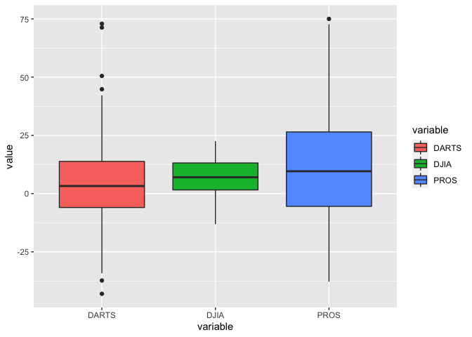
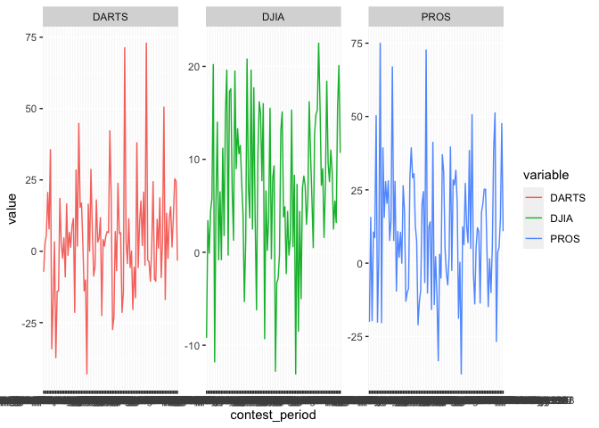
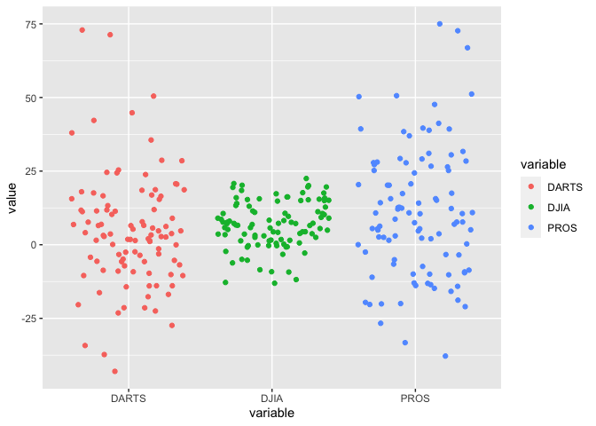
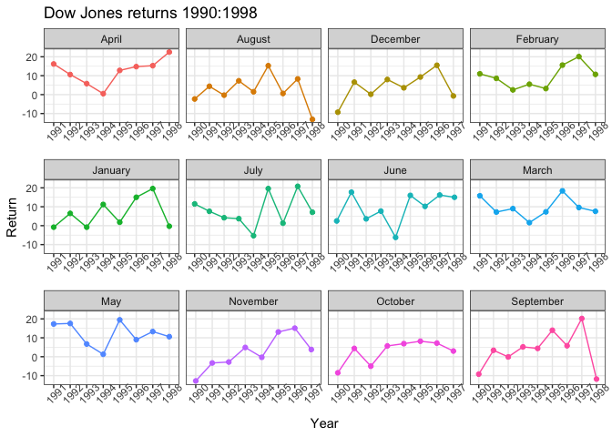

Load in Libraries

```r
library(readr)
library(haven)
library(readxl)
library(tidyverse)
```

```
## ── Attaching packages ─────────────────────────────────────── tidyverse 1.3.0 ──
```

```
## ✓ ggplot2 3.3.3     ✓ dplyr   1.0.3
## ✓ tibble  3.0.5     ✓ stringr 1.4.0
## ✓ tidyr   1.1.2     ✓ forcats 0.5.0
## ✓ purrr   0.3.4
```

```
## ── Conflicts ────────────────────────────────────────── tidyverse_conflicts() ──
## x dplyr::filter() masks stats::filter()
## x dplyr::lag()    masks stats::lag()
```

```r
library(downloader)
library(haven)
```
Load in Data

```r
Data1 <- read_rds(url("https://github.com/WJC-Data-Science/DTS350/raw/master/Dart_Expert_Dow_6month_anova/Dart_Expert_Dow_6month_anova.RDS"))
Data2 <- read_csv(url("https://raw.githubusercontent.com/WJC-Data-Science/DTS350/master/Dart_Expert_Dow_6month_anova/Dart_Expert_Dow_6month_anova.csv"))
```

```
## 
## ── Column specification ────────────────────────────────────────────────────────
## cols(
##   contest_period = col_character(),
##   variable = col_character(),
##   value = col_double()
## )
```

```r
Data3 <- read_dta(url("https://github.com/WJC-Data-Science/DTS350/raw/master/Dart_Expert_Dow_6month_anova/Dart_Expert_Dow_6month_anova.dta"))
Data4 <- read_sav(url("https://github.com/WJC-Data-Science/DTS350/raw/master/Dart_Expert_Dow_6month_anova/Dart_Expert_Dow_6month_anova.sav"))
DataF <- tempfile()
download("https://github.com/WJC-Data-Science/DTS350/raw/master/Dart_Expert_Dow_6month_anova/Dart_Expert_Dow_6month_anova.xlsx?raw=true", DataF, mode = "wb")
Data5 <- read_xlsx(DataF)
```


```r
all_equal(Data1, Data2, Data3, convert = TRUE)
```

```
## [1] TRUE
```

```r
all_equal(Data1, Data4, Data5, convert = TRUE)
```

```
## [1] TRUE
```


```r
ggplot(Data2, aes(x = variable, y = value, fill = variable)) +
  geom_boxplot()
```

<!-- -->
From this graph, we can see the PROS variable has the largest amount of variables while the DIJA variable has the least amount of values which means it is the most consistent. The variable DARTS has the most outliers meaning it is the most inconsistent. 

```r
ggplot(Data2, aes(x = contest_period, y = value, color = variable, group = variable)) +
  geom_line() +
  facet_wrap(~ variable, scales = "free")
```

<!-- -->
In this graph, we can see that the varibale DIJA has the most changes over time, while the variable DARTS has the least amount of change over time meaning it is more reliable. However, the variables DARTS and PROS have the largest time over time resulting in a large negative value. 

```r
ggplot(Data2, aes(x = variable, y = value, color = variable)) +
  geom_jitter() 
```

<!-- -->
In this graph, we can see the variable DJIA is the most consistent with the majority of its values falling in the -5 to 25 range. DARTS and PROS have a higher range of values but also have a higher chance of being negative. The variable PROS has the best chance at being positive overall. 

```r
Returns <- Data2 %>%
  filter(variable == 'DJIA') %>%
  mutate(contest_period = str_replace_all(contest_period, '19', '_19'),
         contest_period = str_replace(contest_period, 'Febuary', 'February'),
         contest_period = str_replace(contest_period, 'Dec._1993', 'December_1993')) %>%
  separate(contest_period, into = c("Month", "year_end"), sep = '-') %>%
  separate(year_end, into = c("Month", "year"), sep = '_') %>%
  pivot_wider(names_from = "year", values_from = "value") %>%
  arrange(factor(Month, levels = month.name)) %>%
  select(-variable)
view(Returns)
```


```r
saveRDS(Returns, file = "Returns.rsd")
```


```r
Returns %>%
  pivot_longer(2:10, names_to = "year", values_to = "return", values_drop_na = TRUE) %>%
  ggplot(aes(x = year, y = return, group = Month)) +
    geom_point(aes(color = Month)) +
    geom_line(aes(color = Month)) +
    facet_wrap(~Month, scales = 'free_x') +
    labs(x = 'Year', y = 'Return' , title = 'Dow Jones returns 1990:1998') +
    theme_bw() +
    theme(legend.position = 'none', axis.text.x = element_text(angle = 45))
```

<!-- -->
In this plot, we can see how the stocks are changing within a 6 month period. The month of August has the most changes through the years meaning August is not the best time to buy stocks. October is the most constistent throughout the years so October would be the best time to buy or sell stocks. 
